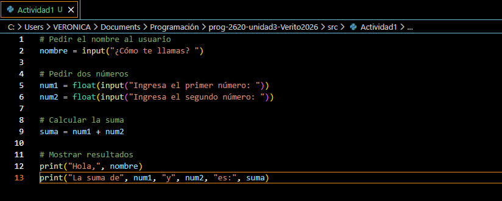
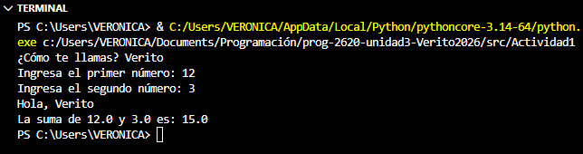
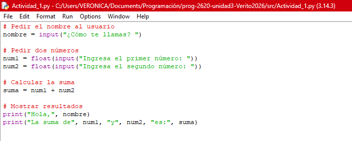
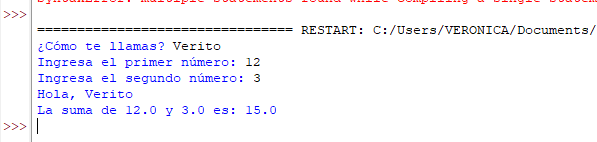
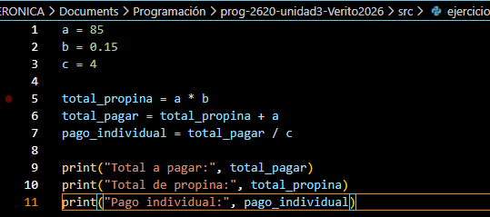
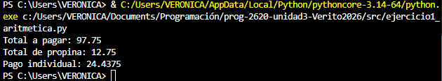
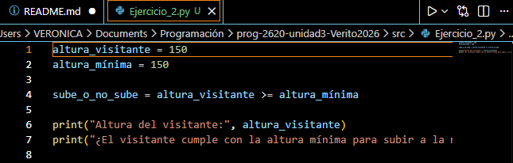
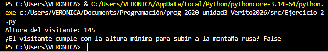

# Repositorio Unidad \#
## Información del estudiante
Nombre:  Veronica Alexandra Micanquer Moreno  

ID.: 000588473   
## Descripción del repositorio
Reemplace estas líneas por la descripción de su repositorio  

# Actividad 1: Ambiente de Desarrollo Integrado (IDE)  
1. Crea un script de Python y edítalo tanto con el IDLE de Python, como con VS Code. 

-Script en python 
  
  

-Script en el IDLE de python  
  

2. Crea una cuenta en Google Colab y crea un código de Python, prueba que funcione. Agrega un bloque de texto y explica qué fue lo que hiciste. 

3. Agrega imágenes (pantallazos) utilizando cada uno de los IDEs vistos en esta actividad.  

4. Responde las siguientes preguntas con tus propias palabras (Nada de definiciones con IA o copiadas de internet). 
    1. ¿Qué es un IDE?  
    Es un programa que sirve para escribir código, ejecutarlo y probar pequeños ejercicios sin necesidad de instalar herramientas más complejas. Es ligero y fácil de usar, por eso es muy útil cuando uno está aprendiendo los conceptos básicos de programación.
    2. ¿Cuál es la diferencia entre los 3 IDEs estudiados en esta actividad?  
       - Visual Studio es un entorno muy completo y más profesional, pensado para proyectos grandes y con muchas herramientas integradas.
       - IDLE de Python es el entorno básico que viene con Python; es sencillo y ligero, ideal para aprender y hacer programas pequeños.
       - Google Colab funciona en línea (en el navegador), por lo que no necesita instalación y permite ejecutar código usando internet, además de facilitar compartir los trabajos.
    3. ¿Cuál utilizarás en el resto del curso y por qué?  
       Utilizaré Visual Studio porque ya estamos familiarizados con él, entonces se hace mucho más fácil su uso.

# OPERADORES 

 ### Pregunta Orientadora:   
 Piensa en tu día a día. ¿Cuántas veces realizas cálculos mentales (como saber si te alcanza el dinero) o tomas decisiones basadas en condiciones (como "si llueve Y hace frío, llevo abrigo")? ¿Cómo crees que le enseñamos a una computadora a hacer exactamente lo mismo?  
 R/=En mi día a día hago cálculos mentales muchas veces, por ejemplo cuando miro si me alcanza el dinero o cuando decido algo según una condición, como si está lloviendo. Para enseñarle eso a una computadora, se le dan instrucciones paso a paso usando operaciones matemáticas y condiciones para que tome decisiones según lo que pase.   

### Ejercicio 1: La cuenta del restaurante   
> Imagina que fuiste a cenar con 3 amigos (son 4 en total). La cuenta fue de $85. Además, quieren dejar un 15% de propina.
Escribe un programa en Python que calcule:
> 
> 1. El total de la propina.
> 2. El total a pagar (cuenta + propina).
> 3. Cuánto debe pagar cada uno, dividiendo en partes iguales.

- Código de python:   
 

- Despues de ejecutarlo:   

      

### Ejercicio 2: El guardián de la montaña rusa  
Para subir a la nueva montaña rusa del parque, los visitantes deben medir al menos 150 cm.
Escribe un programa donde declares una variable altura_visitante (asígnale el valor que quieras). Luego, utiliza un operador relacional para imprimir True si puede subir o False si no puede.  

- Código de python:     

- Despues de ejecutarlo:     

- Prueba con una altura de 145    

- Prueba con una altura de 160  

### > **Ejercicio 3: Sistema de Becas**
Una universidad otorga becas a los estudiantes si cumplen **alguna** de estas dos condiciones:
> 
> - Tener un promedio mayor o igual a 9.0.
> - Estar en un nivel socioeconómico nivel 1 **Y** tener un promedio mayor a 8.0.
> 
> 📤 **Acción en Bitácora:** Diseña la lógica en Python utilizando variables y operadores relacionales y lógicos. Sube tu análisis y código a la bitácora de tu repositorio explicando cómo funciona la evaluación de tu programa.
>
